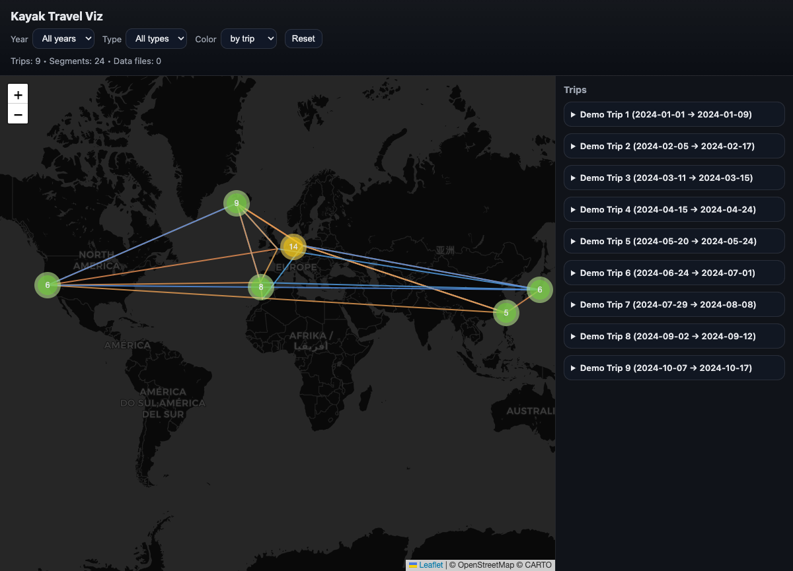

# Kayak Travel Viz (static map)

A tiny static site to visualize your Kayak trip-history export on an interactive world map.

- **No backend required** (Leaflet + GeoJSON)
- Designed for **static hosting** (GitHub Pages / Netlify / any web server)
- Includes a **fake demo dataset** so you can publish the repo without leaking your real travel history

## Demo (GitHub Pages)

After enabling Pages, the demo is available here:

- https://herman-ze-german.github.io/kayak-travel-viz/

## Screenshot



## How it works

- The map UI lives in `docs/` (GitHub Pages serves from there)
- Trip data is two files:
  - `docs/trips.geojson` (LineString routes + Point markers)
  - `docs/summary.json` (trip grouping for the right sidebar)

## Generate demo data (safe to publish)

```bash
python3 scripts/make_demo_data.py --out docs --seed 7 --trips 9
```

## Build from your real Kayak export (private)

1) Export your trip history from Kayak.
2) Put the JSON-ish `*.txt` files into a local folder (do **not** commit them).
3) Run the parser to generate the site data:

```bash
python3 -m venv .venv
source .venv/bin/activate
pip install -r requirements.txt

python3 scripts/build.py --in /path/to/kayak/trips --out docs
```

Then open `docs/index.html` or deploy the `docs/` folder.

### Defunct airport codes

Some historic trips may contain deprecated airport codes.
This project includes a small alias/patch system in `scripts/build.py` (e.g. `TXL→BER`, `SXF→BER`) and supports a manual airport patch table.

## Deploy to GitHub Pages

1) Go to **Repo → Settings → Pages**
2) Source: **Deploy from a branch**
3) Branch: `main`
4) Folder: `/docs`

GitHub Pages will serve `docs/index.html`.

## Credits bubble (optional)

The UI includes a tiny “ⓘ” credit bubble in the bottom-left.

To remove it entirely:
- delete the `<footer class="credit" …>` block from `docs/index.html` (and `site/index.html` if you use `site/` directly)
- optionally remove the `.credit*` CSS in `docs/assets/style.css`

## License

MIT
